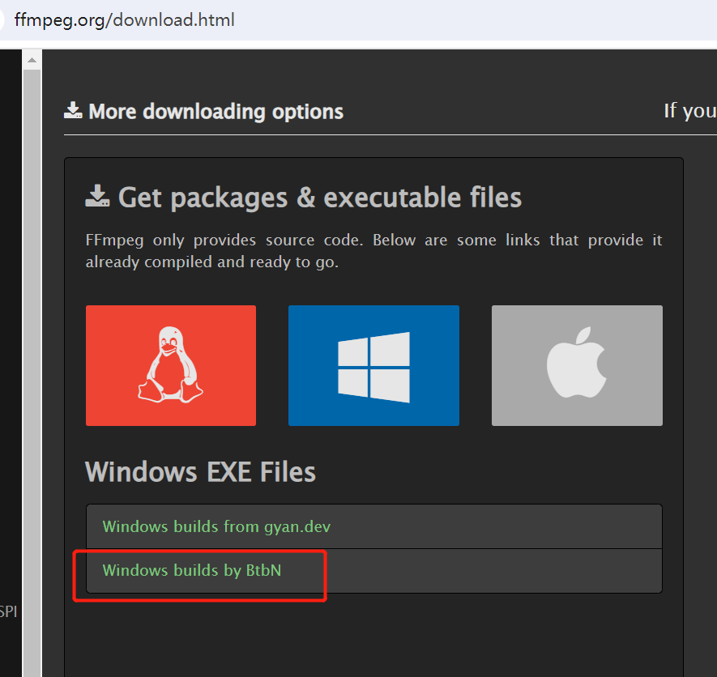
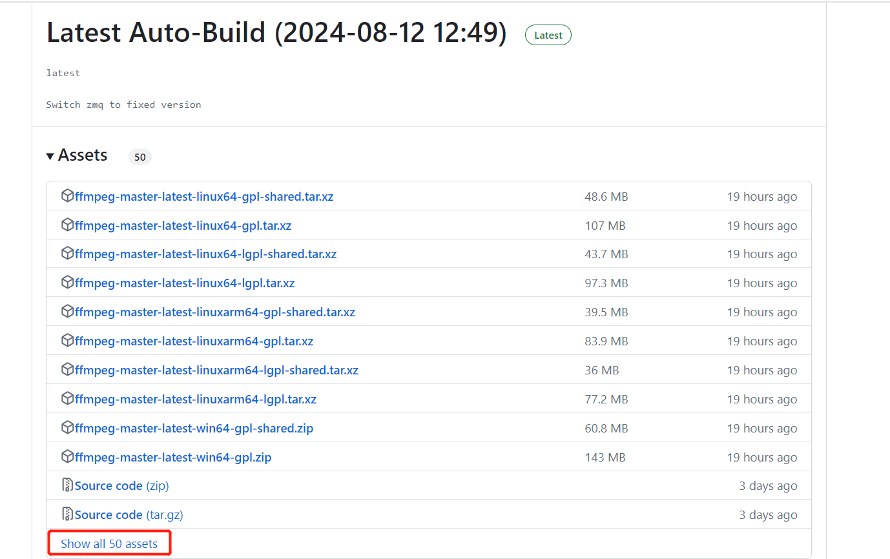
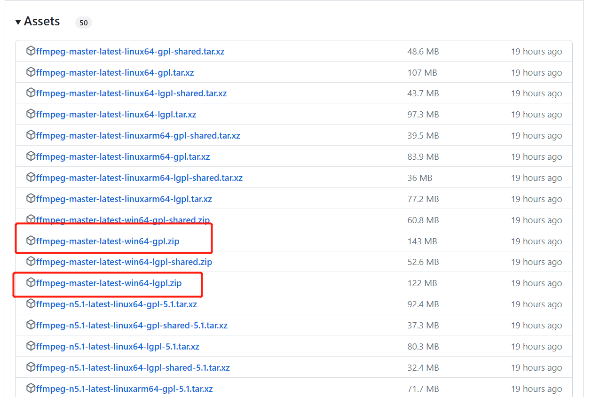

# FFmpeg安装方法

FFmpeg 是一个非常流行的多媒体框架，广泛应用于音视频的处理和转换。它能够录制、转换以及流式传输音视频文件。FFmpeg 是开源的，并且支持几乎所有的音视频格式，具有强大的功能和灵活的命令行工具。

‍

FFmpeg框架由多个核心库组成，每个库负责不同的功能：

* **libavcodec**: 负责各种音视频编解码。
* **libavformat**: 负责多媒体容器格式的解析和生成。
* **libavfilter**: 提供音视频过滤功能。
* **libswscale**: 用于图像缩放和颜色空间转换。
* **libswresample**: 用于音频采样率转换。
* **libavutil**: 包含常用的辅助函数。

### 功能特性

* **格式转换**: 支持几乎所有的多媒体格式，可以在不同的格式之间进行转换。
* **剪辑和编辑**: 可以裁剪、拼接音视频片段，添加字幕、滤镜和效果等。
* **录制和流式传输**: 支持从多种输入源录制音视频，并进行实时流式传输。
* **信息查询**: 通过ffprobe获取文件的详细技术信息。
* **高效的编解码**: 提供了多种高效的编解码器，实现了多媒体文件的高质量压缩和解压。

‍

‍

下面介绍一下ffmpeg的安装以及使用方法：

https://ffmpeg.org/download.html

‍

点击  [Windows builds by BtbN](https://github.com/BtbN/FFmpeg-Builds/releases)

​​

‍

‍

跳转到

https://github.com/BtbN/FFmpeg-Builds/releases

‍

‍

‍

​​

‍

点击 Show all 50 assets

‍

点击这两个中的一个进行下载：

​​

‍

* 文件提供了不同的许可证选项：`gpl`​ 和 `lgpl`​。
* **GPL (通用公共许可证)** : 这是FFmpeg的完整版，包含所有功能和组件。如果您不介意在分发您的软件时遵守GPL许可证的要求，可以选择这个版本。
* **LGPL (较宽松的通用公共许可证)** : 这个版本不包含某些受专利保护的组件，使用时要求较少。如果您希望避免GPL许可证的限制，可以选择这个版本。

‍

‍

然后解压文件夹后

添加至环境变量

即可使用ffmeg命令

ffmpeg-master-latest-win64-gpl.zip

‍

如：

‍

‍

以下是几个简单且常用的FFmpeg命令示例，涵盖了视频转换、剪切、音频提取等常见任务：

### 1. **视频格式转换**

将视频从一种格式转换为另一种格式：

```bash
ffmpeg -i input.mp4 output.avi
```

这个命令将输入的`input.mp4`​文件转换为`output.avi`​文件。

### 2. **提取音频**

从视频文件中提取音频：

```bash
ffmpeg -i input.mp4 -q:a 0 -map a output.mp3
```

这个命令将`input.mp4`​中的音频提取并保存为`output.mp3`​，`-q:a 0`​表示音频质量不损失。

### 3. **剪切视频**

剪切视频文件，从00:01:00（1分钟）开始，持续10秒：

```bash
ffmpeg -i input.mp4 -ss 00:01:00 -t 10 -c copy output.mp4
```

这个命令从`input.mp4`​的1分钟位置开始，剪切出10秒的视频并保存为`output.mp4`​。

### 4. **合并视频**

将多个视频文件合并成一个（文件列表保存在`file_list.txt`​中）：

```bash
ffmpeg -f concat -safe 0 -i file_list.txt -c copy output.mp4
```

​`file_list.txt`​ 文件内容格式如下：

```arduino
file 'file1.mp4'
file 'file2.mp4'
file 'file3.mp4'
```

### 5. **调整视频分辨率**

将视频调整到指定分辨率（例如720p）：

```bash
ffmpeg -i input.mp4 -vf scale=-1:720 output.mp4
```

这个命令将`input.mp4`​的分辨率调整为720p，并输出为`output.mp4`​。

### 6. **添加水印**

在视频的左上角添加一个水印图片：

```bash
ffmpeg -i input.mp4 -i watermark.png -filter_complex "overlay=10:10" output.mp4
```

这个命令将水印图片`watermark.png`​添加到`input.mp4`​的视频上，位置为距离左上角10像素的地方，并输出为`output.mp4`​。

### 7. **视频压缩**

使用H.264编码器压缩视频：

```bash
ffmpeg -i input.mp4 -vcodec libx264 -crf 23 output.mp4
```

这个命令使用H.264编码器将`input.mp4`​视频压缩，并保存为`output.mp4`​。`-crf`​参数越小，质量越高（文件越大）。

这些命令是FFmpeg的基础操作，能够满足大多数视频和音频处理的需求。您可以根据需要进一步调整这些命令的参数。

‍

‍

‍

‍
