# Linux 下nvidia驱动安装方式以及cuda安装

访问如下网址：

https://www.nvidia.cn/drivers/lookup/

输入自己电脑的显卡型号：

​​

‍

‍

​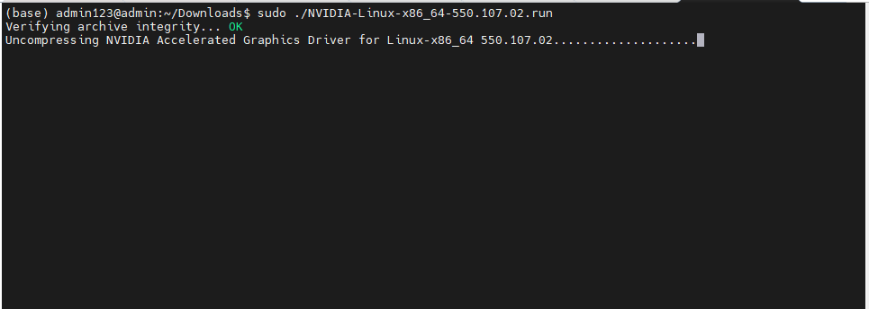​

‍

​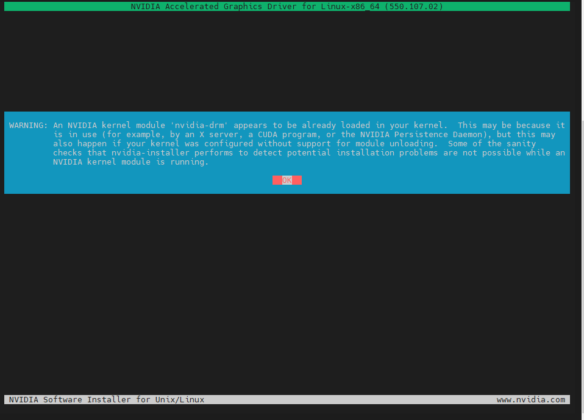​

‍

‍

‍

​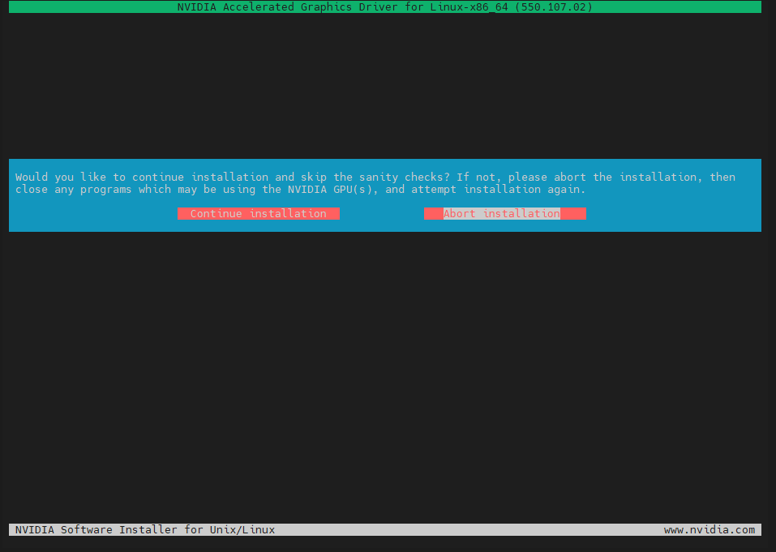​

‍

‍

这个提示是指安装程序检测到有程序正在使用 NVIDIA GPU，因此建议你关闭这些程序，以确保驱动程序能够顺利安装。如果你选择继续安装，可能会跳过一些必要的检查步骤，这有可能导致驱动安装不完整或系统不稳定。

提示内容的详细解释如下：

*  **&quot;Would you like to continue installation and skip the sanity checks?&quot;** ：询问你是否希望继续安装，并跳过安全检查。
*  **&quot;If not, please abort the installation, then close any programs which may be using the NVIDIA GPU(s), and attempt installation again.&quot;** ：如果不希望跳过检查，建议你取消安装，然后关闭任何可能正在使用 NVIDIA GPU 的程序，并再次尝试安装。

‍

‍

‍

‍

​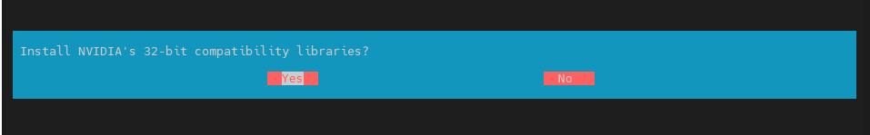	是否安装32位  一般不安装

‍

‍

​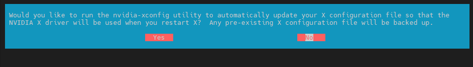​

一般选yes

​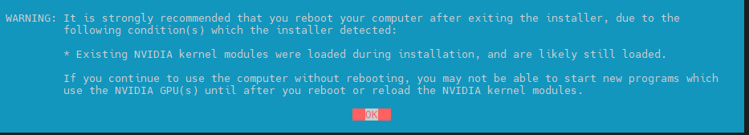​

这个警告信息是在告诉你，安装程序检测到在安装过程中已经有 NVIDIA 内核模块被加载，并且这些模块很可能仍然处于加载状态。为了确保新安装的驱动程序正常工作，强烈建议你在退出安装程序后立即重启计算机。

### 警告的详细解释：

* **Existing NVIDIA kernel modules were loaded during installation**: 这表示在你进行 NVIDIA 驱动安装时，系统中已经加载了一些旧的 NVIDIA 驱动模块。
* **Strongly recommended that you reboot your computer**: 安装程序建议你重启计算机，以便卸载旧的内核模块，并加载新安装的模块。
* **May not be able to start new programs**: 如果你不重启，可能会导致你无法启动新程序，这些程序需要使用新的 NVIDIA GPU 驱动才能正常工作。

‍

‍

‍

​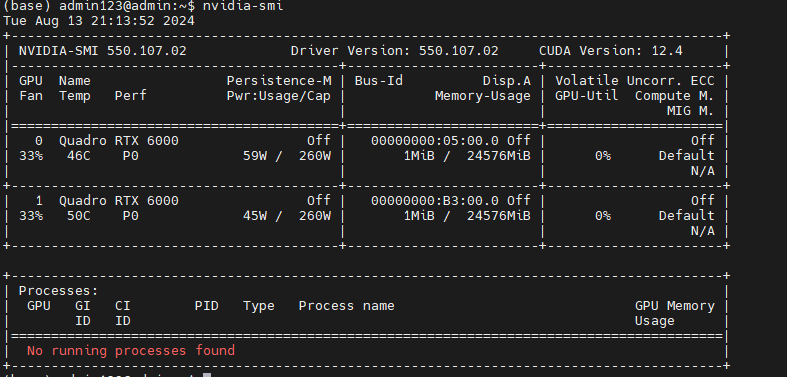​

成功安装

‍

‍

550表示显卡驱动安装版本，12.4表示能够支持的最高CUDA版本，也就是说你安装的CUDA版本不能高于这个。

‍

‍

​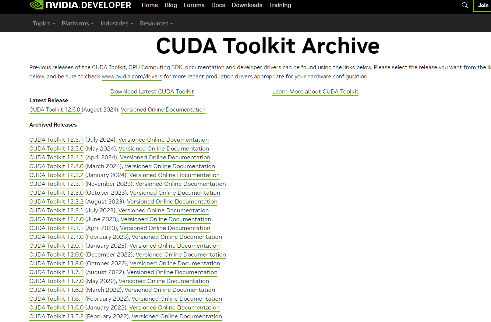​

‍

‍

‍

​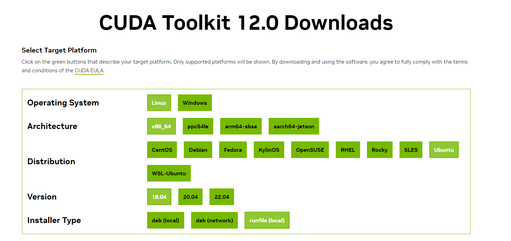​

‍

​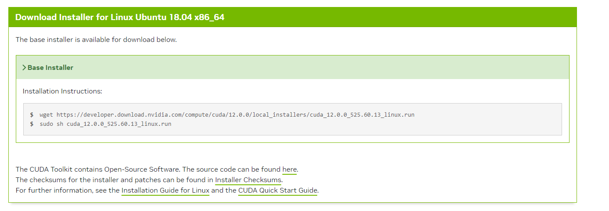​

‍

‍

​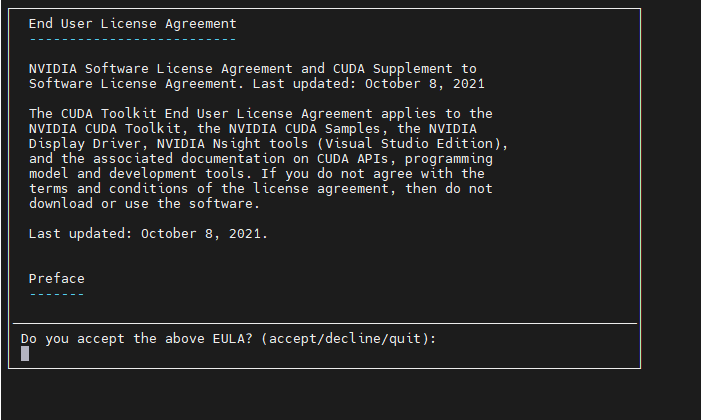​

‍

输入 acctpt

‍

​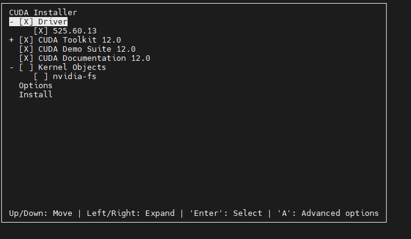​

‍

​`nvidia-fs`​ 是 NVIDIA 提供的一个文件系统模块，它主要用于高性能计算和深度学习应用场景下的共享存储系统。如果你正在设置或使用涉及大量数据集的高性能计算环境，或者你有需求使用 GPU 进行密集的深度学习任务，并且这些任务涉及共享存储（如在多个节点之间共享数据），那么安装 `nvidia-fs`​ 可能是有益的。

### 什么时候需要安装 `nvidia-fs`​？

* **高性能计算（HPC）环境**：如果你的系统是一个多节点集群，且需要在多个节点之间共享 GPU 计算资源，`nvidia-fs`​ 可以帮助你优化数据访问性能。
* **分布式深度学习**：如果你在进行分布式深度学习训练，并且需要在不同的计算节点之间高效共享数据，那么 `nvidia-fs`​ 可能会很有用。

### 什么时候可以不安装 `nvidia-fs`​？

* **单机系统**：如果你只是使用单个 GPU 进行开发或训练模型，而不涉及跨节点的数据共享，那么 `nvidia-fs`​ 通常是不需要的。
* **不涉及复杂的共享存储需求**：如果你的工作负载不涉及大规模的数据共享和存储系统集成，那么安装 `nvidia-fs`​ 可能并没有什么实际作用。

‍

​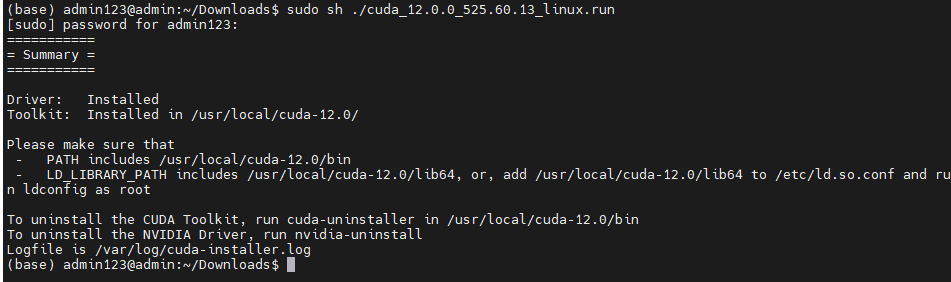​

‍

添加环境变量：

​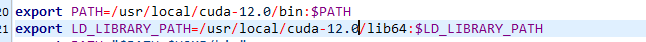​

最后，运行以下命令来使改动生效：

```text

source ~/.bashrc
```

输入nvcc -V

‍

​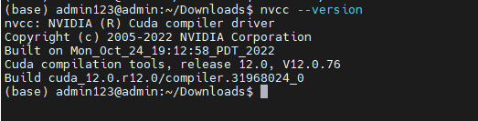​

‍

‍

## cuDNN安装

‍

https://developer.nvidia.com/rdp/cudnn-archive#a-collapse805-111

‍

​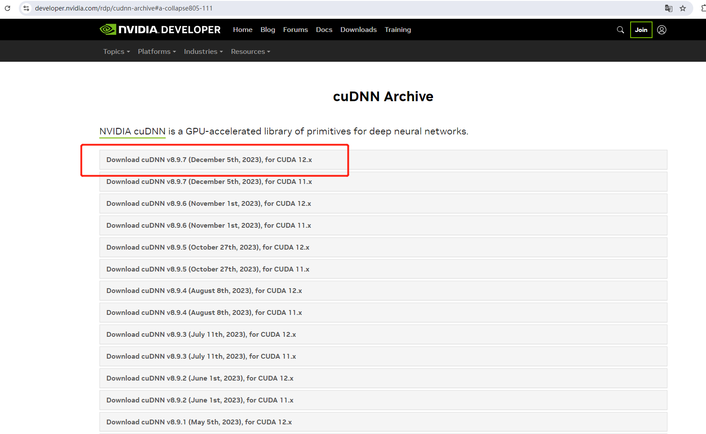​

‍

‍

​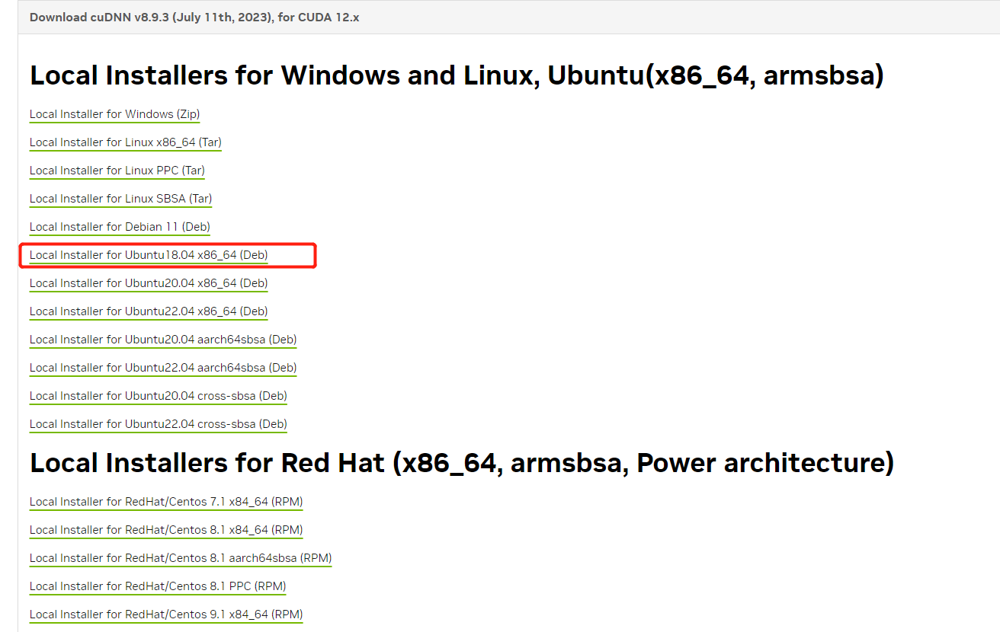​

​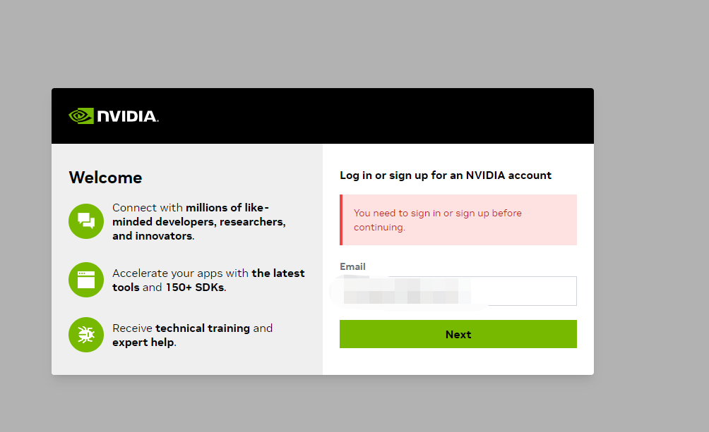​

‍

‍

​​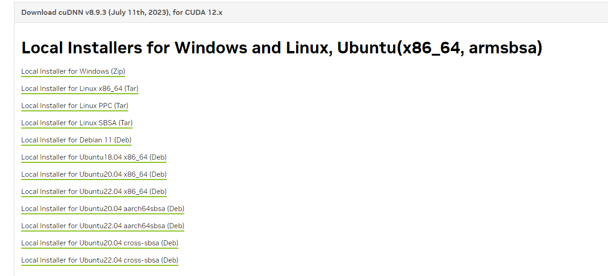​

‍

‍

解压文件

‍

sudo apt install 文件名

‍

‍

‍

‍

​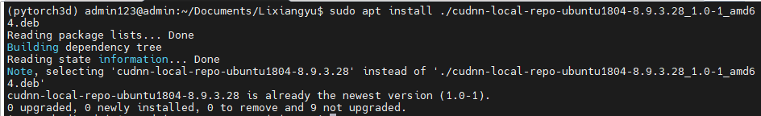​

‍

‍

‍

然后输入 nvidia-smi  如果输出一下内容，则证明成功安装驱动
