# 安装VS步骤

‍

‍

​​

​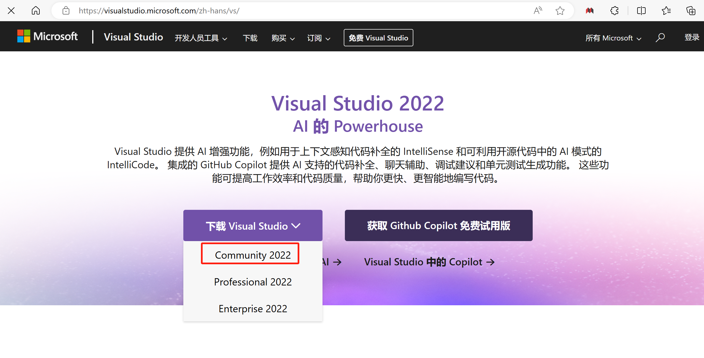​

​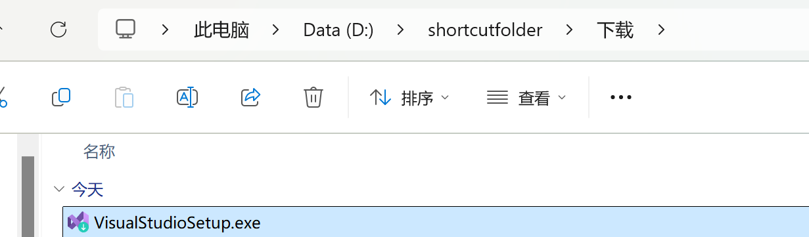​

​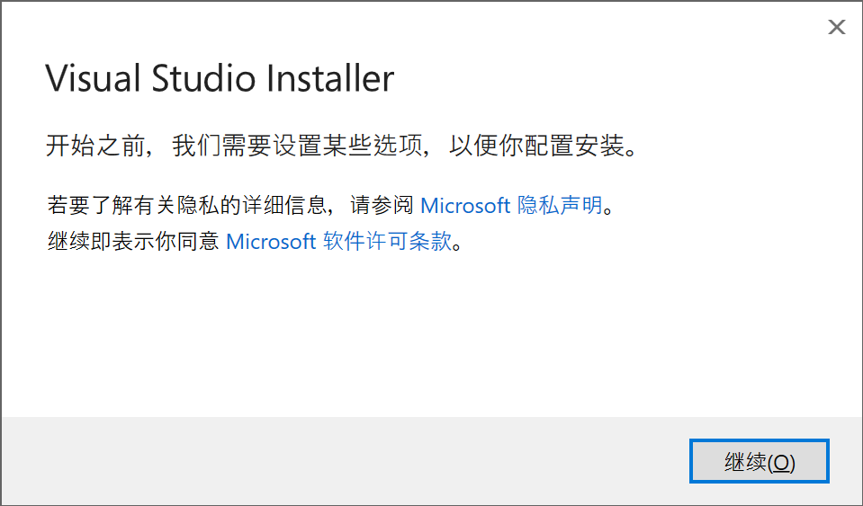​

​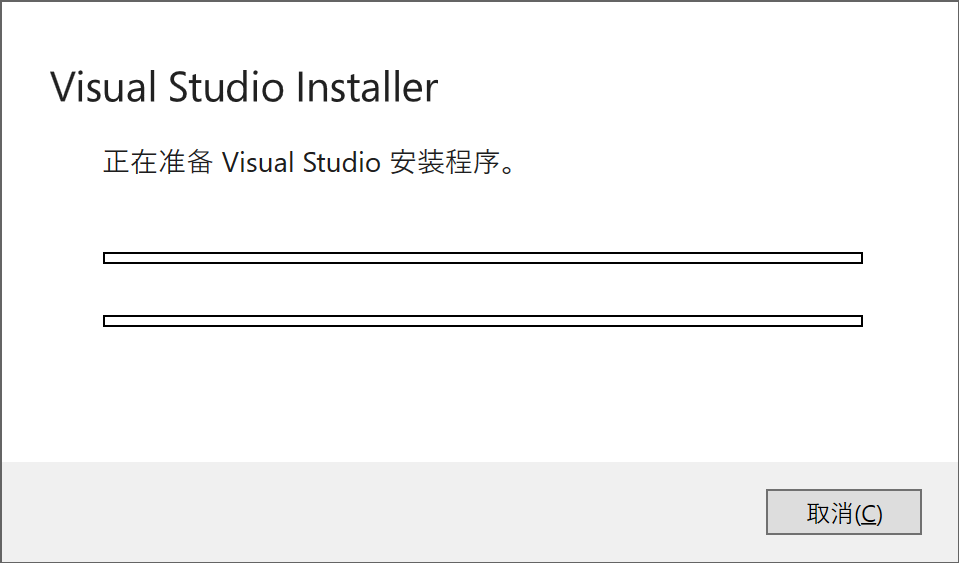​

‍

‍

​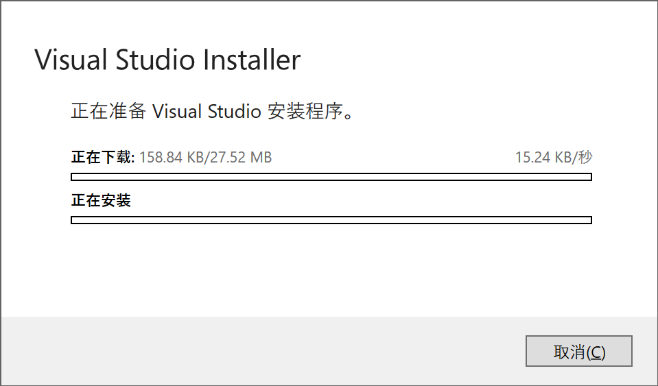​

‍

如果发现太慢

则使用以下办法

​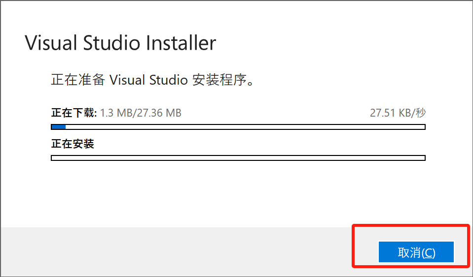​

​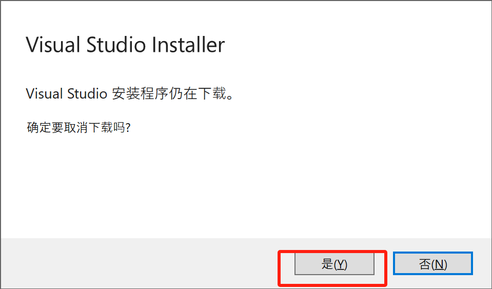​

‍

‍

[Dns检测|Dns查询 - 站长工具 (chinaz.com)](https://tool.chinaz.com/dns/)

‍

‍

输入download.visualstudio.microsoft.com

‍

‍

​​

‍

找到TTL数值较小的一个(不是越小越好)，复制，然后组成这一行加到host文件中

110.242.20.64 download.visualstudio.microsoft.com(前面的IP写自己搜到的那一个)

‍

‍

‍

​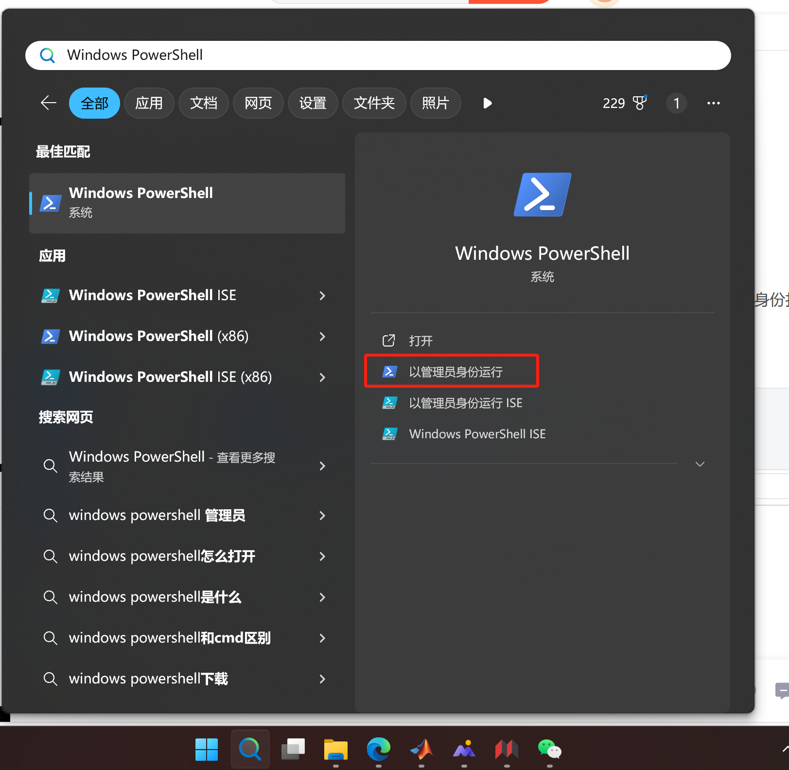​

‍

‍

cd C:\Windows\System32\drivers\etc

​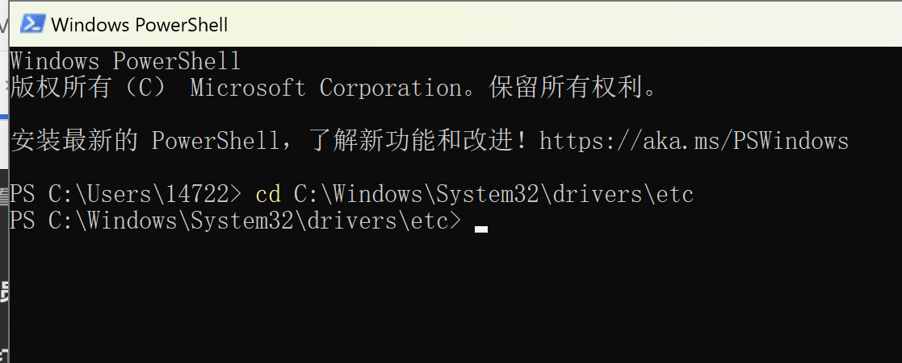​

‍

‍

输入notepad hosts并回车打开hosts，在末尾加上刚才那一段话

​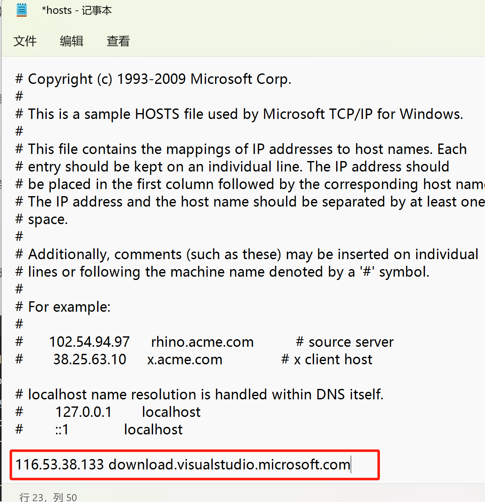​

如果不能直接保存 另存为后去掉后缀名然后替换原文件

‍

‍

**刷新DNS（这一步一般不需要）** ：windows徽标+R，打开cmd, 执行`ipconfig /flushdns`​

‍

‍

‍

​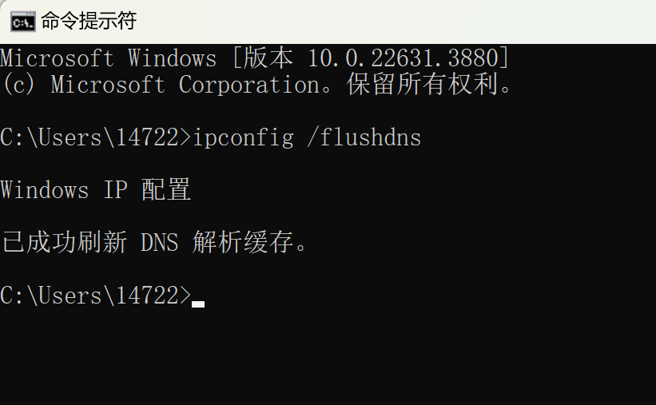​

‍

发现速度快了很多！！

‍

​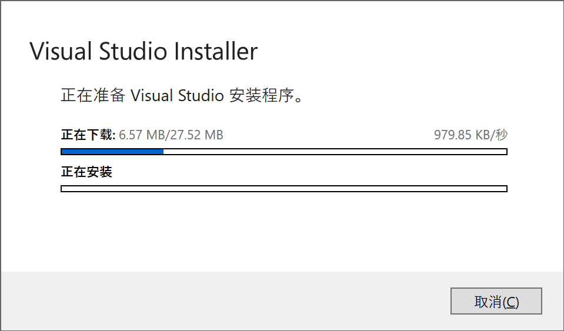​

‍

‍

下载完成后自动弹出如下界面

‍

​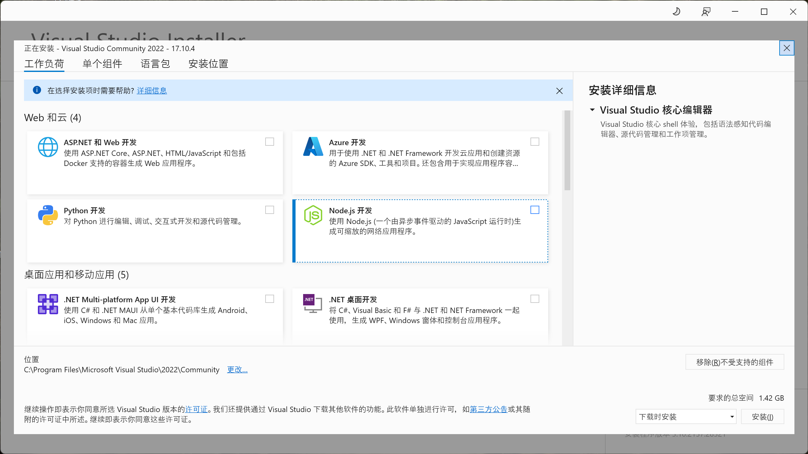​

‍

点击更改

将C盘换成D盘

当然要是你的C盘足够大 那就不用换

​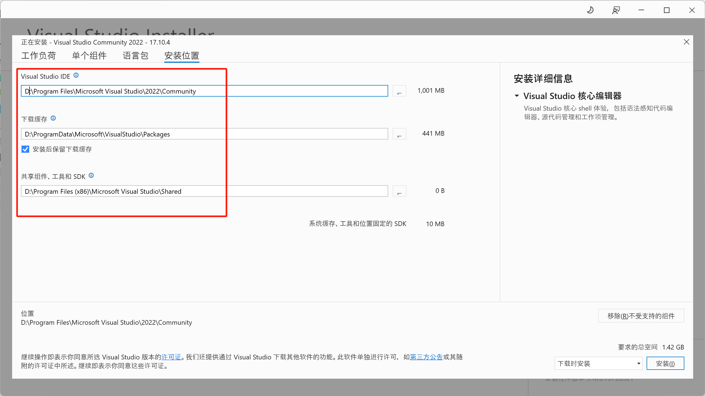​

‍

选择使用 C++ 的桌面开发和Linux 的 C++ 开发

（先选这两个 不够再装）

‍

​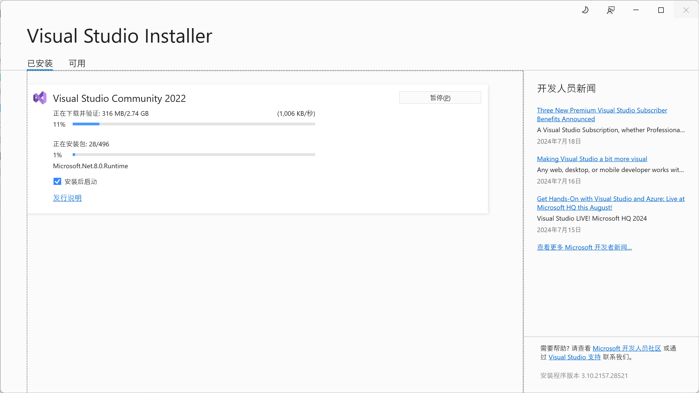安装成功之后即可使用。
