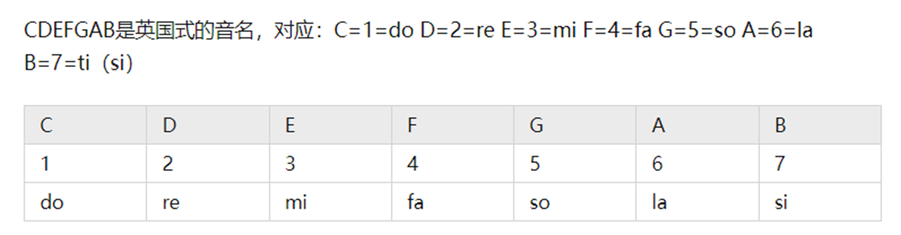
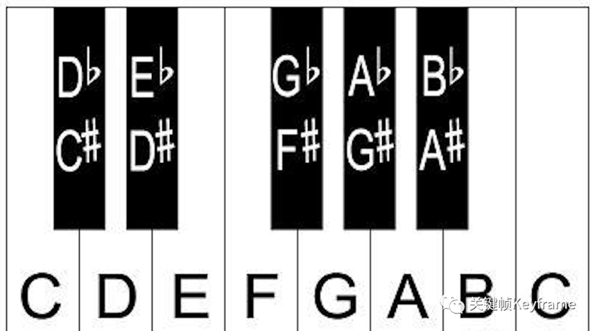
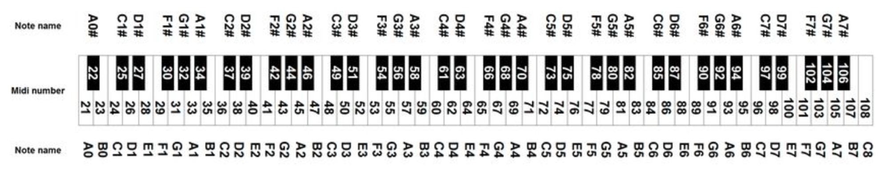

# 乐音基础性质

频率比：

计算两个音的频率的比值。

用来计算两个音之间的距离。

公式如下：k\=f2/f1

如：c1和c2的频率比为

$f(c_2 )/f(c_1 ) =523,26Hz/261.63Hz=2$

可见一个八度的频率比为2

八度值：

从一个do音到下一个do音的音程，就是一个八度。

在12平均律中，八度距离由12个音符组成，包括自然音符（A、B、C、D、E、F、G）和半音符（升号和降号）。

每一个八度，频率差2倍，每n个八度，频率差$2^n$ 倍。

‍

​​

‍

‍

​​

‍

‍

‍

​​

‍

‍

定义标准音：440 Hz

‍

‍
