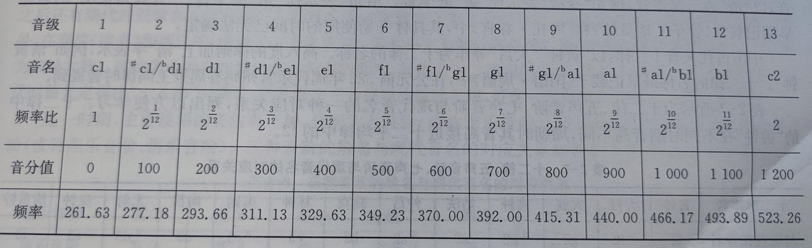
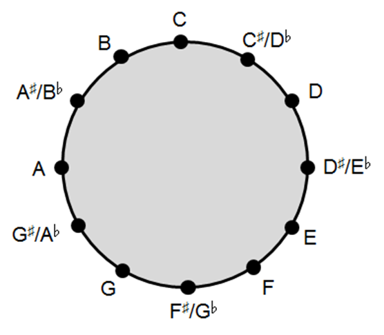
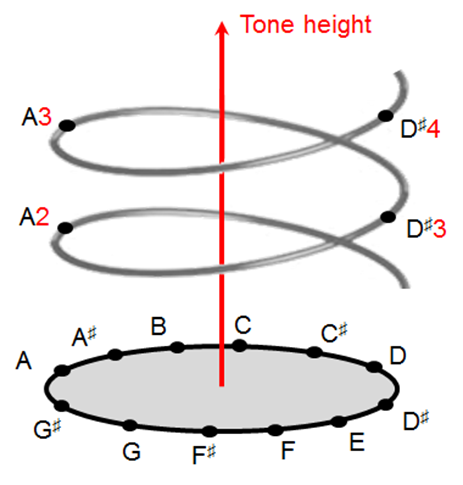
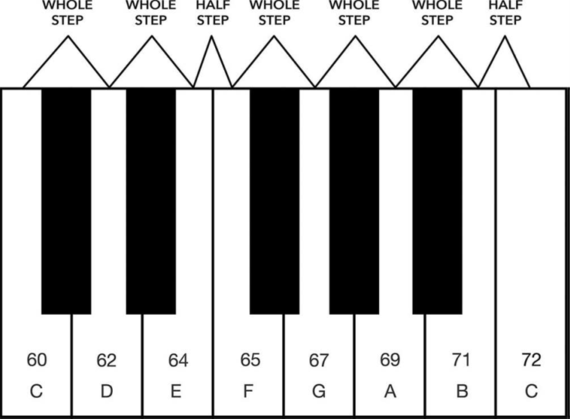

# 十二平均律

十二平均律：

在一个倍频程范围内，按照频率的对数刻度分为12个等分的音阶。

在12个音阶中，相邻两个音叫做半音关系。两个半音的频率比为√(12&2):1

两个半音成为一个全音；

每一个八度，频率差2倍，每n个八度，频率差$2^n$倍。

‍

​​

‍

‍

​​

‍

‍

​​

‍

‍

‍

最常用的有：C（全音）、D（全音）、E（全音）、F（半音）、G（全音）、A（全音）、B（半音），对应白键。

‍

•进一步使用的有：

•#C（升C、也叫bD、降D，是CD之间夹着的半音）、

•#D（升D、也叫bE、降E，是DE之间夹着的半音）、

•#F（升F、也叫bG、降G，是FG之间夹着的半音）、

•#G（升G、也叫bA、降A，是GA之间夹着的半音）、

•#A（升A、也叫bB、降B，是AB之间夹着的半音）。

•对应白健中间的黑键。

‍

​​

‍

‍

‍
